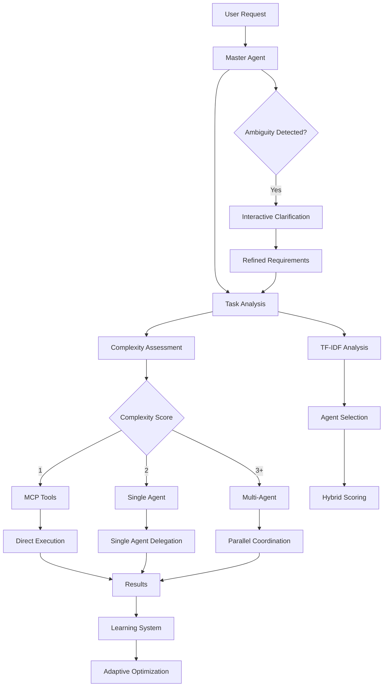

# 📋 SubAgent Master System Overview

**Version 3.5.0** - Enhanced orchestration system with intelligent MCP integration, TF-IDF categorization, and adaptive agent selection.

## 🎯 System Purpose

The SubAgent Master system is an intelligent orchestration platform designed to automatically analyze, categorize, and delegate tasks to specialized agents or MCP tools. It serves as the central coordinator for complex task execution with adaptive learning and intelligent resource selection.

## 🏗️ System Architecture

### Core Components

```
subagent-master/
├── agents/
│   └── master.md                    # Master orchestrator agent
├── config/
│   └── knowledge-base/              # Consolidated algorithm modules
│       ├── agent-selection.yaml    # Agent selection & scoring algorithms
│       ├── tfidf-system.yaml        # TF-IDF implementation & fallback
│       ├── task-analysis.yaml       # Task complexity & domain analysis
│       ├── categorization-engine.yaml # ML categorization & semantic analysis
│       └── parallel_coordination.yaml # Parallel execution coordination
├── config/
│   ├── dynamic/                     # Dynamic configuration
│   │   └── enhanced_agent_registry.yaml
│   ├── rules/                       # Selection rules & thresholds
│   │   └── selection_rules.yaml
│   └── core/                        # Core configuration management
│       └── configuration_loader.yaml
├── docs/                           # System documentation
│   ├── overview.md                  # This file
│   ├── algorithms.md               # Algorithm descriptions
│   └── examples.md                 # Usage examples
├── .claude-plugin/                 # Plugin metadata
│   ├── manifest.json
│   ├── marketplace.json
│   └── plugin.json
└── llms.txt                        # LLM navigation index
```

### Information Flow



## 🔄 Core Processing Workflow

### Phase 1: Task Analysis & Classification
- **Complexity Assessment**: 1-5 scale evaluation
- **Domain Classification**: ML + TF-IDF categorization
- **Ambiguity Detection**: Requirement completeness analysis
- **Priority Assessment**: Time and resource priority

### Phase 2: Intelligent Agent Selection
- **Hybrid Scoring**: ML (40%) + TF-IDF (30%) + Performance (20%) + Complexity (10%)
- **Compatibility Matrix**: Agent-capability matching
- **Relevance Thresholds**: Minimum 0.3 relevance requirement
- **Adaptive Learning**: Performance-based weight adjustment

### Phase 3: Task Distribution
- **Complexity 1**: Direct MCP tool execution
- **Complexity 2**: Single optimal agent delegation
- **Complexity 3+**: Multi-agent coordination with parallel execution

### Phase 4: Execution & Monitoring
- **Progress Tracking**: Real-time execution monitoring
- **Error Handling**: Comprehensive fallback mechanisms
- **Result Synthesis**: Intelligent result combination
- **Learning Integration**: Performance feedback collection

## 🧠 Knowledge Base Modules

### Agent Selection (`agent-selection.yaml`)
**Purpose**: Intelligent agent selection with hybrid scoring algorithms

**Key Components:**
- Hybrid scoring system implementation
- TF-IDF enhanced relevance analysis
- Performance metrics integration
- Compatibility matrix calculations
- Adaptive learning feedback loops

**Algorithms:**
- Agent compatibility analysis
- Multi-factor scoring system
- Selection confidence calculation
- Performance-based weight optimization

### TF-IDF System (`tfidf-system.yaml`)
**Purpose**: Text analysis and similarity matching for task-agent relevance

**Key Components:**
- Sklearn integration with fallback system
- Lightweight TF-IDF implementation for LLM environments
- Adaptive parameter tuning
- Cosine similarity calculations
- Keyword extraction and normalization

**Features:**
- Dynamic n-gram range adjustment
- Performance-based feature optimization
- Fallback keyword matching system
- Category-specific parameter tuning

### Task Analysis (`task-analysis.yaml`)
**Purpose**: Comprehensive task analysis and complexity assessment

**Key Components:**
- 1-5 complexity scale evaluation
- Domain classification algorithms
- Priority assessment frameworks
- Resource requirement analysis
- Ambiguity detection mechanisms

**Evaluation Criteria:**
- **Score 1**: Trivial tasks (<2 hours)
- **Score 2**: Simple tasks (2-4 hours)
- **Score 3**: Moderate tasks (4-8 hours)
- **Score 4**: Complex tasks (8-16 hours)
- **Score 5**: Very complex tasks (>16 hours)

### Categorization Engine (`categorization-engine.yaml`)
**Purpose**: ML-based task categorization with semantic analysis

**Key Components:**
- Machine learning categorization models
- Semantic analysis algorithms
- Ensemble classification approaches
- Adaptive learning mechanisms
- Category performance tracking

**Features:**
- Multi-domain classification
- Semantic similarity analysis
- Category evolution based on feedback
- Performance-based category weighting

### Parallel Coordination (`parallel_coordination.yaml`)
**Purpose**: Multi-agent parallel execution management

**Key Components:**
- Parallel execution coordination
- Result synthesis strategies
- Synchronization protocols
- Progress monitoring systems
- Conflict resolution mechanisms

**Capabilities:**
- Simultaneous agent processing
- Intelligent result combination
- Cross-agent disagreement handling
- Real-time execution tracking

## 🎮 Master Agent Capabilities

### Core Functionality
- **Task Orchestration**: Automatic delegation and coordination
- **Intelligent Selection**: Optimal agent/tool selection
- **Complexity Analysis**: Multi-dimensional task assessment
- **Interactive Clarification**: Context-aware requirement gathering
- **Parallel Execution**: Coordinated multi-agent processing
- **Adaptive Learning**: Continuous system improvement

### MCP Tool Integration
- **Sequential Thinking**: Complex reasoning and analysis
- **Serena**: Project navigation and code understanding
- **Context7**: Documentation and framework patterns
- **Tavily**: Web search and real-time information
- **Magic**: UI component generation and design
- **Playwright**: Browser automation and testing

### Performance Metrics
- **Distribution Accuracy**: >90% correct routing
- **Clarification Success**: >85% ambiguity resolution
- **TF-IDF Relevance**: >80% meaningful matches
- **Learning Efficiency**: >15% improvement over time
- **Overall Success**: >95% task completion

## 🔧 Configuration System

### Dynamic Configuration (`enhanced_agent_registry.yaml`)
- **Agent Definitions**: Capabilities and performance data
- **Registry Management**: Dynamic agent registration
- **Performance Tracking**: Historical performance metrics
- **Capability Matrices**: Agent-domain compatibility

### Selection Rules (`selection_rules.yaml`)
- **Thresholds**: Minimum performance and relevance requirements
- **Routing Logic**: Task-to-agent mapping rules
- **Priority Systems**: Task prioritization frameworks
- **Fallback Mechanisms**: Graceful degradation strategies

### Core Configuration (`configuration_loader.yaml`)
- **System Settings**: Global configuration parameters
- **Hot Reload**: Dynamic configuration updates
- **Environment Settings**: Deployment-specific configurations
- **Integration Points**: External system connections

## 🚀 Usage Patterns

### Automatic Task Routing
```yaml
Simple Search Task:
  Input: "Search React best practices"
  Complexity: 1
  Routing: MCP Tools (Tavily)
  Execution: Direct tool execution

Bug Fix Task:
  Input: "Fix CSS styling issue"
  Complexity: 1
  Routing: Single Agent (Frontend Architect)
  Execution: Optimized agent delegation

Feature Implementation:
  Input: "Add authentication system"
  Complexity: 4
  Routing: Multi-Agent Coordination
  Execution: Parallel processing with synthesis
```

### Interactive Clarification
```yaml
Ambiguous Request:
  Input: "Improve user experience"
  Action: Initiate clarification workflow
  Questions: Specific aspects, pain points, target users, success metrics
  Outcome: Refined requirements with clear scope
```

## 📈 Adaptive Learning System

### Performance Tracking
- **Success Rate Monitoring**: Agent and category performance
- **User Feedback Integration**: Satisfaction scoring
- **Execution Metrics**: Time, quality, resource usage
- **Error Analysis**: Failure pattern identification

### Parameter Optimization
- **TF-IDF Tuning**: Dynamic parameter adjustment
- **Weight Optimization**: Performance-based scoring weights
- **Threshold Adjustment**: Minimum requirement tuning
- **Category Evolution**: Systematic category refinement

### Learning Feedback Loop
```yaml
Execution → Performance Collection → Analysis → Parameter Adjustment → System Evolution
```

## 🔍 Quality Assurance

### Validation Gates
- **Task Analysis Validation**: Completeness and accuracy checks
- **Agent Selection Validation**: Compatibility and relevance verification
- **Execution Validation**: Progress and quality monitoring
- **Result Validation**: Outcome accuracy and completeness

### Error Handling
- **Fallback Systems**: Graceful degradation mechanisms
- **Retry Logic**: Intelligent retry with strategy adjustment
- **Error Classification**: Systematic error categorization
- **Recovery Mechanisms**: Automatic error recovery strategies

### Performance Monitoring
- **Real-time Tracking**: Live execution monitoring
- **Metric Collection**: Comprehensive performance data
- **Benchmarks**: System performance baseline
- **Optimization**: Continuous performance improvement

## 🔮 System Evolution

### Version 3.5.0 Features
- Enhanced MCP tool integration
- Improved TF-IDF categorization
- Adaptive learning capabilities
- Interactive clarification system
- Parallel execution coordination
- Hybrid scoring algorithms

### Future Roadmap
- Advanced ML model integration
- Enhanced natural language understanding
- Expanded MCP tool ecosystem
- Improved learning algorithms
- Advanced analytics and reporting

---

**System Status**: Production-ready with comprehensive orchestration capabilities.

**Architecture**: Modular design with intelligent workflow orchestration and adaptive learning.

**Performance**: Optimized for LLM execution with pseudocode algorithms and continuous improvement.