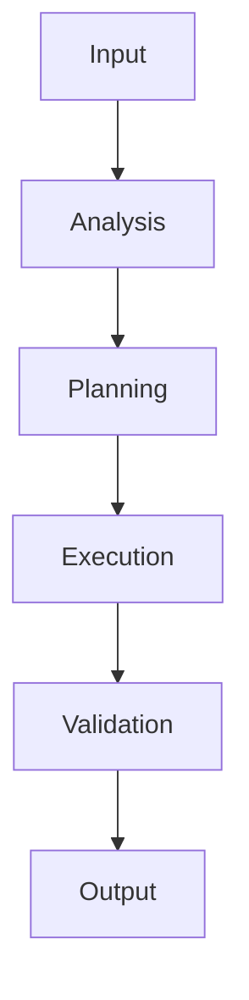

# 🔄 Workflow Section Template

## 🚀 Execution Flow

## 📋 Standard Process
1. **Initialization:** [what happens on start]
2. **Analysis Phase:** [analysis steps and outputs]
3. **Decision Phase:** [decision criteria and logic]
4. **Execution Phase:** [execution steps and methods]
5. **Validation Phase:** [validation criteria]
6. **Finalization:** [completion steps]

## 🔀 Decision Trees
- **Simple Tasks:** [direct path criteria]
- **Complex Tasks:** [branching logic]
- **Ambiguous Cases:** [how ambiguity is handled]
- **Error Cases:** [error handling paths]

## ⚡ Optimization Strategies
- **Performance Optimization:** [speed optimization methods]
- **Quality Optimization:** [accuracy improvement methods]
- **Resource Optimization:** [resource usage optimization]
- **Parallelization:** [when and how tasks are parallelized]

## 🔄 Feedback Loops
- **Self-Correction:** [how it detects and fixes issues]
- **User Feedback:** [how user input is incorporated]
- **Learning:** [how it improves over time]
- **Adaptation:** [how it adapts to new contexts]

## 🎯 Context Management
- **Context Gathering:** [what information is collected]
- **Context Processing:** [how context is analyzed]
- **Context Application:** [how context influences decisions]
- **Context Retention:** [how context is maintained]

**Content Sources from original:**
- "Workflow", "Process", "Execution" sections
- Decision logic and branching patterns
- Optimization strategies and performance methods
- Feedback mechanisms and learning processes
- Context management procedures

**Target Size:** 200-250 lines (compress from ~1000 lines)
**Compression Ratio:** ~75% reduction
**Key Strategy:** Use flowcharts, concise step descriptions, group related processes